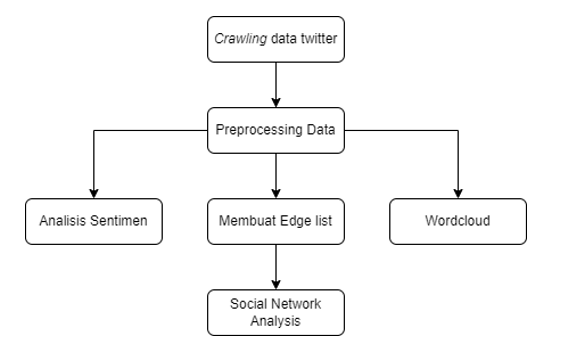
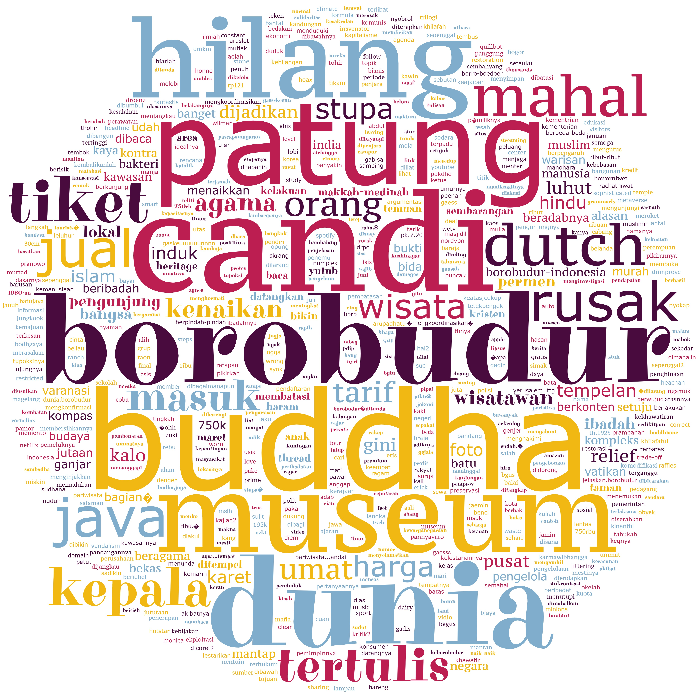
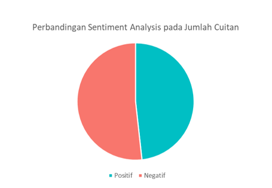
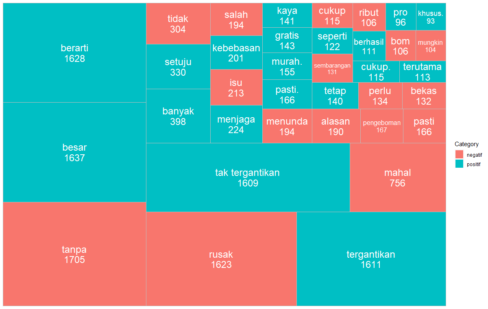
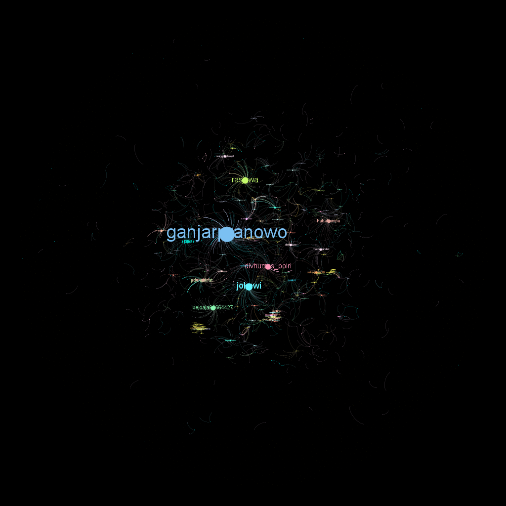

<h1 align="center">
  IMPLEMENTASI <i>SOCIAL NETWORK ANALYSIS </i> DALAM PENYEBARAN INFORMASI WACANA KENAIKAN HARGA TIKET CANDI BOROBUDUR DI TWITTER
</h1>
<h2>Ringkasan Penelitian</h2>
<h3>1. Latar Belakang </h3>
  
 
&nbsp;&nbsp;&nbsp;&nbsp;&nbsp; Wacana kenaikan harga tiket masuk candi Borobudur berawal dari pengumuman Menteri Koordinator Bidang Kemaritiman dan Investasi Luhut Binsar Pandjaitan bahwa harga tiket untuk naik ke Candi Borobudur menjadi Rp 750.000 bagi wisatawan domestik dan 100 dolar AS untuk wisatawan mancanegara. Wacana ini merupakan upaya pemerintah untuk menjaga Candi Borobudur. Pembatasan kuota, kewajiban untuk menggunakan tour guide lokal dan penggunaan alas kaki merupakan upaya pemerintah dalam menjaga konservasi pada area Stupa. Hal ini dilakukan karena Candi Borobudur saat ini menghadapi berbagai kerentanan dan ancaman seperti pelapukan batuan, perubahan iklim, erupsi gunung berapi, hingga gempa bumi.
   

     
 
&nbsp;&nbsp;&nbsp;&nbsp;&nbsp; Sejak diumumkan, keputusan terkait wacana kenaikan harga tiket Candi Borobudur menjadi perbincangan di platform media social. Di media twitter misalnya, kata kunci “Borobudur” menjadi tranding topik, berbagai macam diskusi terkait pro-kontra wacana tersebut dapat ditemukan. 
Dengan fitur thread dan trending, twitter cocok untuk dijadikan tempat diskusi di dunia maya. Opini yang disampaikan melalui twitter biasanya merupakan reaksi spontan dan emosional, yang berupa opini baik maupun negatif. Selain menjadi tempat diskusi, twitter dimanfaatkan oleh pemerintah untuk menyebarkan informasi dan kebijakan pemerintah. Pemerintah memberikan kesempatan bagi publik untuk dapat berpartisipasi dalam pembuatan keputusan. Keikutsertaan publik ini dibuktikan dengan adanya sikap mereka dalam menggunakan suatu media secara spontan tanpa adanya kendali dari suatu aktor di dalamnya. 
   

 
 
&nbsp;&nbsp;&nbsp;&nbsp;&nbsp; Dengan memperhatikan perkembangan koneksi antar pengguna pada twitter serta analisis yang sesuai mengenai text data maka pemanfaatan wordcloud, sentiment analysis dan social network analysis cocok untuk menggambarkan analisis pada wacana kenaikan harga Tiket Candi Borobudur di twitter.
 

  
  
<h3>2. Tujuan Penelitian</h3>
  

&nbsp;&nbsp;&nbsp;&nbsp;&nbsp;Penelitian ini dapat dirumuskan menjadi tiga tujuan yang ingin dicapai.
<ol>
<li> Mengidentifikasi kata yang sering muncul terkait wacana kenaikan harga tiket Candi Borobudur; </li>
<li> Mengkategorikan setiap opini yang muncul kedalam kategori sentiment netral, positif, dan negatif; </li>
<li>	Mengetahui akun-akun twitter berpengaruh yang dapat dimanfaatkan untuk menyerbakan informasi informatif melalui tweet/thread. </li>
</ol>
  

  
<h3>3. Metode Penelitian</h3>
  

&nbsp;&nbsp;&nbsp;&nbsp;&nbsp;Metode yang digunakan dalam penelitian ini adalah text mining dan analisis jejaring sosial (Social Network Analysis). Text mining digunakan untuk melihat kata yang sering muncul terkait Borobudur dan respon penggguna twitter terkait wacana kenaikan harga tiket. Sedangkan Social Network Analysis untuk melihat aktor penting atau sentral dalam penyebaran informasi wacana kenaikan harga tiket Candi Borobudur di media sosial twitter.

  &nbsp;&nbsp;&nbsp;&nbsp;&nbsp;Metode text mining yang digunakan dalam penelitian ini adalah pembentukan wordcloud dan analisis sentimen (sentiment analysis). Secara sederhana, wordcloud bisa diartikan sebagai visualisasi kata-kata di mana ukurannya disesuaikan dengan frekuensi munculnya kata tersebut. Wordcloud akan memudahkan pembaca untuk melihat kata-kata yang sering muncul terkait suatu topik. Sedangkan analisis sentimen merupakan analisis teks untuk mengidentifikasi dan mengklasifikasikan pendapat seseorang terkait topik tertentu.

&nbsp;&nbsp;&nbsp;&nbsp;&nbsp;Social Network Analysis (SNA) merupakan analisis yang digunakan untuk merepresentasikan hubungan antar beberapa orang, komunitas, atau perusahaan dengan menggunakan teknik analisis grafik.   SNA ini sering digunakan untuk menentukan aktor sentral di dalam sebuah jaringan dengan menghitung nilai centrality. 

 </img>

<caption align ="center" >Gambar 1. Tahapan Metode Penelitian</caption>

<ol>
  <li> Pengambilan data dilakukan dengan crawling data twitter dengan menggunakan bot pada aplikasi berbasis web Netlytic.org dengan kata kunci “Borobudur” pada tanggal 8 Juni 2022. Jumlah data yang diambil adalah sebanyak 10.000 cuitan </li>
  <li> Cuitan yang telah diambil dilakukan proses cleaning data. Proses ini bertujuan untuk menghilangkan noise dalam cuitan seperti url, link, hastag, menghapus kode ascii dan kata penghubung seperti “yg”, “mjd” ,”utk” serta Cuitan yang bukan berasal dari bahasa Indonesia </li>
  <li> Tweet yang telah di preprocessing, Data dilakukan analisis menggunakan Wordcloud Analysis, Sentiment Analysis dan Social Network Analysis. </li>
 </ol>

 &nbsp;&nbsp;&nbsp;&nbsp;&nbsp; Software yang digunakan dalam proses pengolahan data adalah R studio, Microsoft Excel, dan Gephi 0.9.2. R studio dan Microsoft Excel digunakan dalam proses pengambilan dan pembersihan data tweets, pembuatan wordcloud, serta analisis sentiment. Sedangkan Gephi digunakan untuk melakukan Social Network Analysis (SNA)
 

  <h3>4. Hasil dan Pembahasan</h3>

 
&nbsp;&nbsp;&nbsp;&nbsp;&nbsp;Jumlah data tweets terkait Borobudur pada tanggal 8 Juni 2022 yang dihasilkan dari proses crawling adalah sebanyak 10.000 tweets. Setelah dilakukan proses cleaning data, 	menghapus tweet yang bukan berasal dari Indonesia dan tidak berkaitan dengan Borobudur, diperoleh data sebanyak 8.410 tweets. Selanjutnya dilakukan analisis terhadap data tersebut.

 </img>

<caption align ="center" >Gambar 2. Wordcloud Wacana Kenaikan Harga Tiket Candi Borobudur</caption>

&nbsp;&nbsp;&nbsp;&nbsp;&nbsp;Analisis wordcloud digunakan untuk mengetahui kata-kata yang sering muncul terkait wacana kenaikan harga tiket Candi Borobudur. Semakin sering sebuah kata muncul, maka ukuran kata yang muncul akan semakin besar. Gambar 2 menunjukan bahwa tiga kata yang paling sering muncul adalah kata ”Borobudur”, “Candi” dan “Buddha”.

  &nbsp;&nbsp;&nbsp;&nbsp;&nbsp;Kata yang sering muncul adalah “Borobudur”, “candi”, dan “Buddha” dengan total 310 cuitan. Ketiga kata tersebut memiliki korelasi yang sangat kuat karena Candi Borobudur merupakan Candi Buddha terbesar di Dunia Kata Selanjutnya yang sering muncul adalah “patung” pada 40 cuitan. Seperti yang diketahui salah satu penyebab wacana terkait kenaikan harga tiket Candi Borobudur karena beberapa patung mengalami kerentanan, pelapukan batuan, ancaman erupsi merapi dan adanya vandalisme.

  &nbsp;&nbsp;&nbsp;&nbsp;&nbsp;Kemudian kata yang sering muncul adalah “tiket” dan “mahal” dengan total pada 43 cuitan. Kedua kata tersebut merupakan hasil respon warganet di twitter terkait wacana kenaikan harga tiket Candi Borobudur. Warganet menilai Rp 750.000 untuk biaya tiket Candi Borobudur termasuk mahal. Selain beberapa kata tersebut, kata lain yang juga sering muncul secara berturut-turut adalah “kepala”, “hilang”,“museum”, “jual”, “tertulis”, dan  ”wisata”. Frekuensi munculnya kata-kata tersebut lebih dari 500 kali.

 </img>

  <caption align ="center" >Gambar 3. <i>Pie Chart Sentiment Analysis</i> pada cuitan terkait Wacana Kenaikan Harga Tiket Candi Borobudur</caption>

  

&nbsp;&nbsp;&nbsp;&nbsp;&nbsp;Gambar 3 menunjukkan hasil sentiment analysis terkait wacana kenaikan harga tiket Candi Borobudur yang diperoleh dari 8.410 cuitan di twitter. Jumlah cuitan didominasi kata bersentimen positif. Jumlah cuitan yang mengandung sentimen positif ada sebanyak 5.333 cuitan dengan 13.071 kata bersentimen positif, sedangkan jumlah cuitan yang mengandung kata bersentimen negatif adalah 5.720 cuitan dengan 12.032 kata bersentimen negatif. 
Berdasarkan grafik tersebut mengindikasikan bahwa warganet sebagian masih menentang terkait wacana kenaikan harga Candi Borobudur. Kemudian untuk melihat pembagian klasifikasi pada sentiment analysis berdasarkan kata dapat dilihat melalui grafik berikut.  

 </img>

  <caption align ="center" >Gambar 4. <i>Tree Map Sentiment Analysis </i> pada kata terkait Wacana Kenaikan Harga Tiket Candi Borobudur</caption>

  

&nbsp;&nbsp;&nbsp;&nbsp;&nbsp;Gambar 4 menunjukkan bahwa banyak masyarakat memiliki ragam dalam beropini terkait wacana kenaikan harga tiket Candi Borobudur. Cuitan yang bersentimen negatif  adalah cuitan yang mengandung kata-kata, seperti “rusak”, “mahal”, “tidak”, “isu”, “salah”, “menunda” dan sebagainya. Untuk cuitan yang bersentimen positif merupakan cuitan yang mengandung kata-kata, seperti “besar”, ”banyak”, “setuju”, “menjaga”, ”murah”, dan sebagainya.
Cuitan terkait pembatasan orang dan harga tiket bersentimen negatif. Cuitan tersebut tidak terlepas dari wacana yang dikemukakan oleh pemerintah yang dinilai belum matang. Selain itu cuitan bersentimen negatif banyak ditemui dengan kata kata yang memuat SARA pada akun-akun anonim.  Cuitan yang bersentimen positif terkait wacana tersebut juga cukup banyak. Cuitan ini berkaitan dengan edukasi dan ajakan melestarikan Candi Borobudur. Cuitan positif tersebut rata-rata menyetujui usulan pemerintah untuk menjaga kelestarian pada Candi Borobudur yang dituangkan dalam tweet/thread. 

 </img>

  <caption align ="center" >Gambar 5. Visualisasi Sosial Network Analysis “Borobudur” pada twitter</caption>

 

&nbsp;&nbsp;&nbsp;&nbsp;&nbsp;Setelah dilakukan wordcloud analysis dan sentiment analysis, analisis selanjutnya adalah social network analysis untuk mengetahui aktor yang berpengaruh terkait penyebaran wacana kenaikan harga tiket Candi Borobudur. Gambar 5 merupakan visualisasi social network analysis dari hasil crawling pada twitter terkait Borobudur. Titik pada gambar dinamakan node yang merepresentasikan seorang individu pengguna twitter, sedangkan garis yang menunjukan aktivitas retweet disebut edge. Gambar 4 terbentuk dari 7.634 aktivitas retweet yang melibatkan 7.860 akun pengguna twitter. Dari aktivitas tersebut, terbentuk 1.175 komunitas dengan seorang aktor pusat yang menjadi sumber interaksi karena sering di-retweet oleh pengguna lain.

&nbsp;&nbsp;&nbsp;&nbsp;&nbsp;Sebagai bentuk pemberitahuan terkait wacana kenaikan harga tiket Candi Borobudur, pemerintah dapat memanfaatkan pengguna/akun twitter yang memiliki pengaruh besar untuk memberikan informasi-informasi yang benar, memberikan edukasi terkait Candi Borobudur. Selain itu, akun-akun tersebut juga dapat digunakan untuk memberikan masukan kepada pemerintah terkait wacana kenaikan harga tiket Candi Borobudur. 

<caption align ="center" >Tabel 1. NILAI CENTRALITY PENGGUNA TWITTER BERPENGARUH </caption>
<table border="1" align ="center">
        <tr>
            <td>Nama Pengguna/Akun</td>
            <td>Score Degree Centrality </td>
            <td>Score Closeness Centrality</td>
            <td>Score Eigenvector Centrality </td>
        </tr>
        <tr>
            <td>@ganjarpranowo</td>
            <td>166 </td>
            <td>0</td>
            <td>1.0 </td>
        </tr>
          <tr>
            <td>@detikcom</td>
            <td>25 </td>
            <td>1</td>
            <td>0.13</td>
        </tr>
     <tr>
            <td>@aremanita_</td>
            <td>20 </td>
            <td>0.5652</td>
            <td>0.58</td>
        </tr>
        <tr>
            <td>@cnnindonesia</td>
            <td>15 </td>
            <td>0.0</td>
            <td>0.07</td>
        </tr>
        <tr>
            <td>@kompascom</td>
            <td>13 </td>
            <td>1</td>
            <td>0.06</td>
        </tr>
  </table>
  

  

&nbsp;&nbsp;&nbsp;&nbsp;&nbsp; Tabel 1 menunjukan bahwa terdapat lima akun yang memiliki pengaruh dalam penyebaran informasi terkait wacana kenaikan harga tiket Candi Borobudur di twitter. Akun @ganjarpranowo memiliki skor degree centrality dan eigenvector centrality paling tinggi dibandingkan akun lainnya. Hal ini berarti, akun @ganjarpranowo memiliki jumlah mention terbanyak, dan unggul dalam hubungannya dengan pengguna berpengaruh lain di dalam jaringan twitter.

&nbsp;&nbsp;&nbsp;&nbsp;&nbsp;Akun @ganjarpranowo merupakan akun dari Gubernur Jawa Tengah. Akun @ganjarpranowo memberikan informasi yang detail terkait wacana kenaikan harga tiket Candi Borobudur dan sepakat untuk menunda pemberlakuan kenaikan harga tiket Candi Borobudur bersama Menteri Koordinator Bidang Kemaritiman dan Investasi Luhut Binsar Panjaitan.
Akun @aremanita_ memberikan usulan terkait regulasi naik ke atas Candi Borobudur melalui thread seperti bagi umat Buddha yang melakukan ibadah di Candi Borobudur digratiskan, pemberlakuan kuota dapat ditunjang dengan pendaftaran online, dan mengusulkan untuk mengevaluasi terkait harga yang diwacanakan.

&nbsp;&nbsp;&nbsp;&nbsp;&nbsp;Selain akun pengguna biasa, akun berita resmi seperti @detikcom, @cnnindonesia, @kompascom juga memiliki peran penting dalam perkembangan informasi terkait wacana kenaikan harga tiket Candi Borobudur di twitter. Hal ini tidak terlepas dari seringnya akun-akun tersebut membuat tweet berkaitan dengan perkembangan dan informasi-informasi resmi dan terpercaya terkait wacana tersebut. Sehingga warganet dapat mudah mengetahui informasi secara cepat dan akurat.

    
 

  
    
<h3>5. Kesimpulan dan Saran</h3>
<h4>A. Kesimpulan</h4>
  <ol>
  <li>Kata yang sering muncul terkait wacana kenaikan harga tiket Candi Borobudur adalah kata “tiket” dan “mahal”. Warganet menilai Rp 750.000 untuk biaya tiket Candi Borobudur termasuk mahal.</li>
  <li>Cuitan terkait wacana kenaikan harga tiket Candi Borobudur didominasi oleh cuitan bersentimen negatif, yaitu sebanyak 5.720 cuitan.</li>
  <li>Akun @ganjarpranowo merupakan akun pengguna twitter yang paling berpengaruh dalam memberikan informasi terkait wacana kenaikan harga Candi Borobudur. Akun media berita resmi memiliki peran penting dalam perkembangan informasi terkait kenaikan harga tiket Candi Borobudur di Twitter.</li>
  </ol>
    
 <h4>B. Saran </h4>
  

&nbsp;&nbsp;&nbsp;&nbsp;&nbsp;Saran terhadap penelitian tugas proyek ini didasarkan pada jawaban dari beberapa responden yang dianggap masuk akal dan diterima oleh penulis berdasarkan hasil survei evaluasi <i>dashboard</i> sebelumnya. Berikut ini beberapa saran yang diajukan oleh responden dan dapat dipertimbangkan untuk dilakukan perbaikan pada <i>dashboard</i> ke depannya.
  <ol>
   <li>Pemerintah diharapkan tidak terburu-buru dalam menetapkan kebijakan atau pernyataan sehingga tidak menimbulkan kegaduhan di sosial media.</li>
   <li>Pemerintah dapat bekerjasama dengan media dan akun yang memiliki pengaruh besar untuk memberikan informasi yang benar dan memberikan edukasi sebelum memberikan pernyataan.</li>
  </ol>
 

  

    
    
    
    

